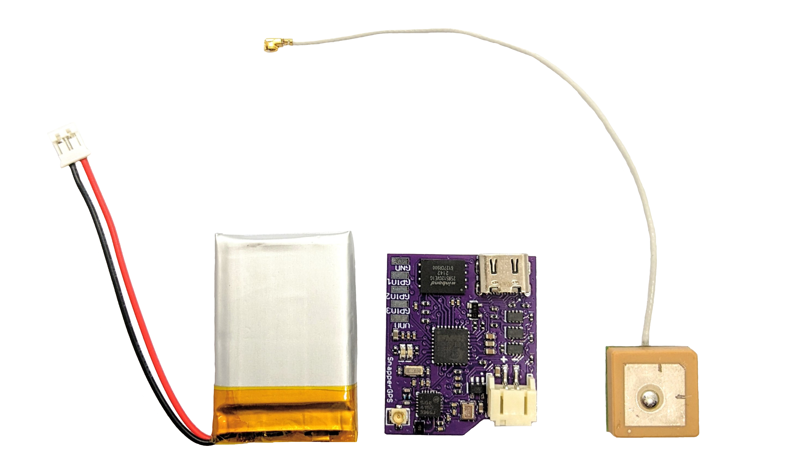
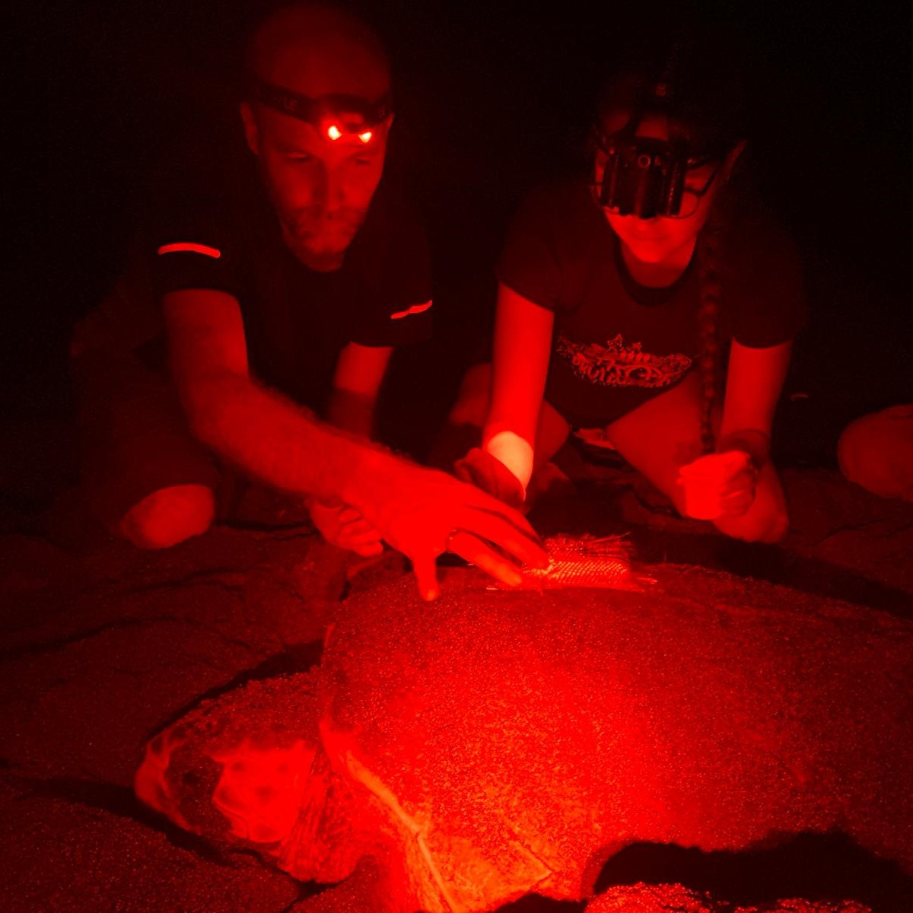

## SnapperGPS (in development)

[SnapperGPS](https://twitter.com/SnapperGPS) is an archival location tracking system that I co-developed as part of my PhD. It comprises a small, low-cost, low-power data logger and a [web application](https://snappergps.info/) that is used to configure the device and handles the post-processing of the data. SnapperGPS achieves real-world accuracies of 10m - 20m and can run for over ten years on a coin cell. Despite its name, SnapperGPS actually uses multiple global navigation satellite systems (GNSS), not just GPS. It also uses Galileo and BeiDou.  

You can read more about the system in this [open access paper in the Journal of Open Hardware](https://openhardware.metajnl.com/articles/10.5334/joh.48). 

SnapperGPS has been successfully deployed on multiple species, including sea turtles and birds. You can read about the first sea turtle deployment in [this ISTS40 conference abstract](https://ora.ox.ac.uk/objects/uuid:c9acf083-d5e5-4265-8425-67509c5e3b9b/files/sgx41mj82p) or [this GitHub conversation](https://github.com/orgs/SnapperGPS/discussions/4).  

Loggerhead sea turtle    | Manx shearwater
:-------------------------:|:-------------------------:
  |  

Follow the project on [Twitter](https://twitter.com/SnapperGPS) for updates. We are hoping to make a version available for purchase soon, however, global chip shortages have been making this difficult. It's all open-source, though, so you can always build your own if you can find the components :)   