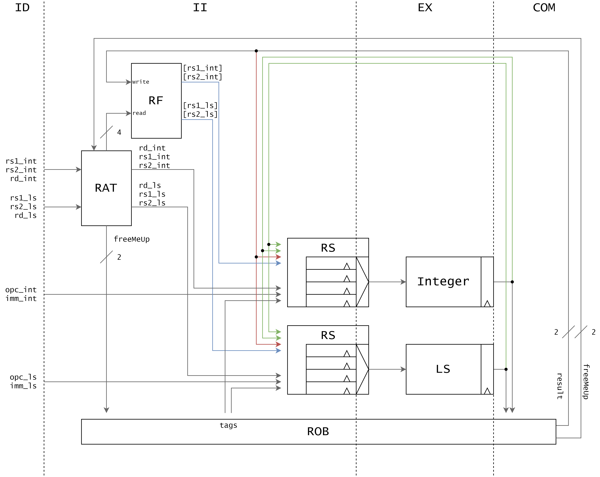

## a BSc thesis on superscalar out-of-order processors - exploiting instruction level parallelism

Superscalar out-of-order execution has become the norm in modern processors. Yet there is little information in the literature about its implementation details. In my BSc thesis, I explore what new hardware structures superscalar out-of-order execution requires. I present a design for a simple processor, implemented in SystemVerilog, that uses register renaming, reservation stations and a reorder buffer to dynamically schedule instructions.  

You can access the whole thesis text [here](https://raw.githubusercontent.com/amanda-matthes/amanda-matthes.github.io/master/docs/bachelor.pdf).