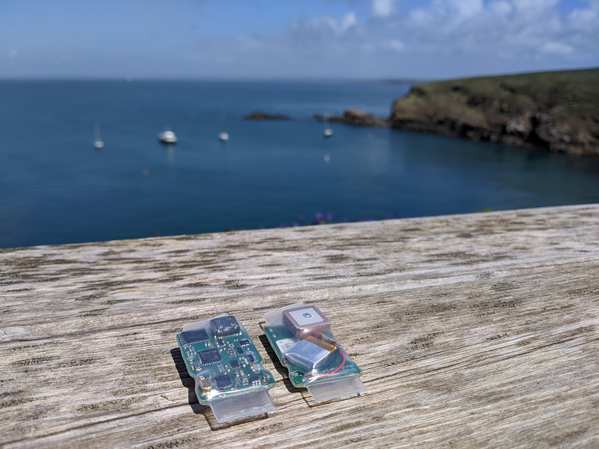

### About
I am a PhD candidate at the University of Oxford with the [AIMS CDT](https://aims.robots.ox.ac.uk/). I have an undergraduate degree in physics from the University of Heidelberg, where I wrote my thesis on superscalar out-of-order processors.  
I am currently working on [SnapperGPS](https://twitter.com/SnapperGPS), a small, low-cost, low-power GNSS location tracking system, specifically developed for wildlife tracking. My supervisor is [Prof Alex Rogers](http://www.cs.ox.ac.uk/people/alex.rogers/).

### SnapperGPS (in development)

[SnapperGPS](https://twitter.com/SnapperGPS) is an archival location tracking system, co-developed with Jonas Beuchert and Prof Alex Rogers. It comprises a small, low-cost, low-power data logger and a [web application](https://snapper-gps.herokuapp.com/) that is used to configure the device and handles the post-processing of the data. SnapperGPS achieves real-world accuracies of 10m - 20m and can run for over ten years on a coin cell. Despite its name, SnapperGPS actually uses multiple global navigation satellite systems (GNSS), not just GPS. It also uses Galileo and BeiDou.  
In 2021 SnapperGPS was deployed on nesting loggerhead sea turtles in Cape Verde. Currently, a SnapperGPS variant is being trialled on Manx Shearwaters in Wales and Northern Ireland.  
Follow the project on [Twitter](https://twitter.com/SnapperGPS) for updates. We are hoping to release a version later this year.  

<!-- ### Oxford University Powerlifting Club
I am currently the Novice Captain for the [Oxford University Powerlifting Club](https://www.ouplc.co.uk/). If you are interested in getting started with lifting heavy weights, get in touch!  
When gyms closed, most of us couldn't train the way we wanted to. To make it through all those months, I started a weekly movie night for fellow lifters to hang out and watch silly strength sport related movies. Send me a message if you would like an invite to the WhatsApp group.   -->

<!-- ### Oxford University Physics Society
The [Oxford University Physics Society](https://oxford-physsoc.com/) organises talks, extracurricular classes and socials for anyone interested physics and its many applications. I am now the society's Media Officer after being the Publicity Officer for a year. You might know me as the occasional host of our Wednesday talks during the pandemic.  
Stay up to date on our events with our [facebook page](https://www.facebook.com/physsoc) or join our mailing list on our [website](https://oxford-physsoc.com/) to become a physics phriend! I also launched our [online store](https://shop.spreadshirt.co.uk/ou-physics-society-stash/all) for all your stash needs.   -->

### BSc Thesis: Exploiting Instruction Level Parallelism
Superscalar out-of-order execution has become the norm in modern processors. Yet there is little information in the literature about its implementation details. This thesis explores what new hardware structures superscalar out-of-order execution requires. It presents a design for a simple processor, implemented in SystemVerilog, that uses register renaming, reservation stations and a reorder buffer to dynamically schedule instructions.  

You can access the whole thesis text [here](https://raw.githubusercontent.com/amanda-matthes/amanda-matthes.github.io/master/docs/bachelor.pdf).  

### Updates

| Date          |News                                                                               |
|---------------|-----------------------------------------------------------------------------------|
| 05/2022       | Deploying SnapperGPS with Manx Shearwaters on Skomer, Wales.                      |
| 03/2022       | Giving a talk at the [International Sea Turtle Symposium (ISTS)](https://www.ists40perth.com.au/) about tracking nesting sea turtles with SnapperGSP.|
| 12/2021       | Our SnapperGPS work is featured on the cover of the 2021 Winter edition of [Inspired Research](https://www.cs.ox.ac.uk/news-events/inspiredresearch.html), the twice-yearly newsletter published by the Department of Computer Science at University of Oxford.|
| 08/2021       | On fieldwork in Cape Verde. Here to track endangered loggerhead sea turtles with [FMB](https://fmb-maio.org/).|
| 05/2021       | I am now the Arts & Culture Officer of the Keble College MCR.                     |
| 05/2021       | Voted in as the new Novice Captain of the [Powerlifting Club](https://www.ouplc.co.uk/)!|
| 02/2021       | This term, I will be hosting our Wednesday talks for the [Physics Society](https://oxford-physsoc.com/).|
| 11/2020       | [Jonas Beuchert](http://users.ox.ac.uk/~kell5462/) and I won 2nd place at the local [ActInSpace](https://actinspace.org/) innovation contest.|
| 09/2020       | The OU Physics Society is part of the inaugural [Varsity Sci](https://fb.me/e/45U1Q5Ntf).|
| 07/2020       | Began my second mini-project with Alex Rogers on Snapshot GPS receivers.          |
| 04/2020       | Began a 10-week project with the [Satellite Applications Catapult](https://sa.catapult.org.uk/).|
| 03/2020       | I am now the new Publicity Officer for the Oxford University Physics Society!     |
| 10/2019       | Started my 4-year PhD at the University of Oxford with the [AIMS CDT](https://aims.robots.ox.ac.uk/).|
| 08/2019       | Went to [QuID](https://qid.ethz.ch/) 2019, a summer school on quantum information at the ETH Zurich.|
| 07/2019       | Started working at the CERN data centre as part of their Summer Student programme.|
| 06/2019       | Defended my BSc [thesis on superscalar out-of-order processing](https://github.com/amanda-matthes/amanda-matthes.github.io/blob/master/docs/bachelor.pdf).|

<!--

### Lecture Notes
Most of my lecture notes are not worth sharing but here are some that might help others taking these courses now (or similar ones).
I usually type out my lecture notes whenever the lecturer does not provide them or if the official notes are not useful. For me, lecture notes need to be searchable (so not handwritten), written in full sentences (so slides don't count) and concise but comprehensive.  
Sometimes I just like to type out lecture notes as a form of revision for the exam.  

#### English notes

[Introduction to Astrophysics and Cosmology](https://github.com/amanda-matthes/amanda-matthes.github.io/blob/master/docs/Introduction_to_Astrophysics_and_Cosmology.pdf) 
Held in the winter of 2017/2018 at the University of Manchester by Prof Gary Fuller and Prof Albert Zijlstra. This course is an introduction to stars, orbits, galaxies and cosmology. 

[Quantum Physics and Relativity](https://github.com/amanda-matthes/amanda-matthes.github.io/blob/master/docs/Quantum_Physics_and_Relativity.pdf) 
Held in the winter of 2017/2018 at the University of Manchester by Prof Brian Cox and Prof Jeffrey Forshaw. It is a very simple introduction to special relativity and quantum physics. 

[Applications of Quantum Physics](https://github.com/amanda-matthes/amanda-matthes.github.io/blob/master/docs/Applications_of_Quantum_Physics.pdf) 
Held in the winter of 2017/2018 at the University of Manchester by Prof Sean Freeman. The course introduces some interesting new technologies in which quantum phenomena like tunnelling and superposition are exploited. This is mostly just a typed out copy of the handwritten lecture notes with some comments by me. 

[Zeeman Spectroscopy](https://github.com/amanda-matthes/amanda-matthes.github.io/blob/master/docs/f44.pdf)  
This is a long evaluation for one of the many experiments that physics students at the University of Heidelberg have to do to get their BSc degree. 

#### German notes

[Experimentalphysik IV](https://github.com/amanda-matthes/amanda-matthes.github.io/blob/master/docs/Experimentalphysik_IV.pdf)  
Held in the summer of 2017 at the University of Heidelberg by Prof Johanna Stachel. Experimental physics IV is a course on nuclear and particle physics.    

 -->

 

Hosted on GitHub Pages - Theme by [orderedlist](https://github.com/orderedlist)
