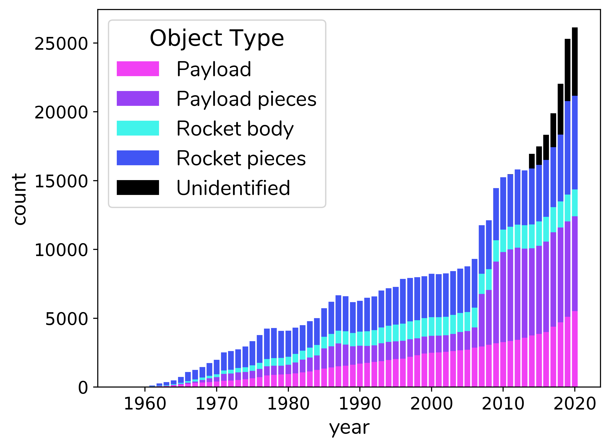

## a mini project report on space debris

Satellites provide humans across the world with many invaluable services. But as we continue to launch an increasing number of missions, those satellites are more and more likely to be damaged by orbiting objects, mostly space debris. In this report, I first explain why space debris is a real concern, and then present four key technologies that can help combat the problem.

This report was written as part of a 10-week mini-project with the Satellite Applications Catapult in 2020. You can access it [here](https://raw.githubusercontent.com/amanda-matthes/amanda-matthes.github.io/master/docs/Amanda_Matthes-Combatting_Space_Debris_with_Autonomous_Systems.pdf).